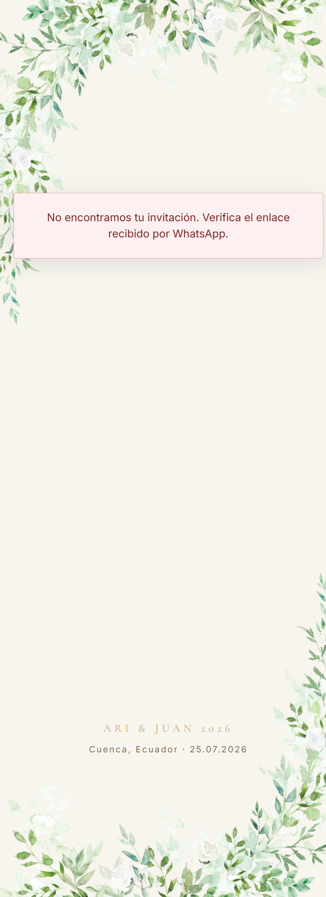
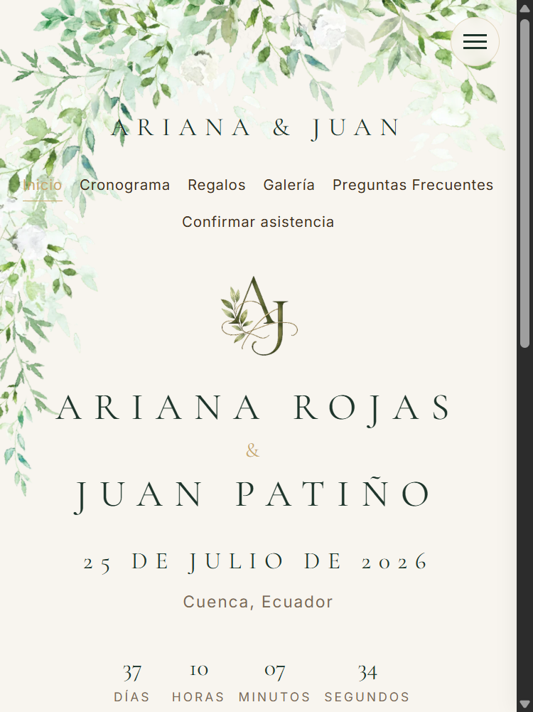
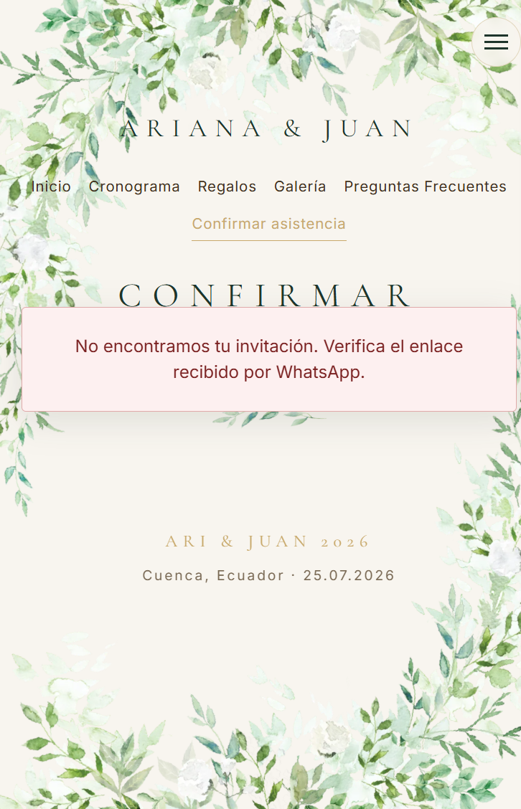
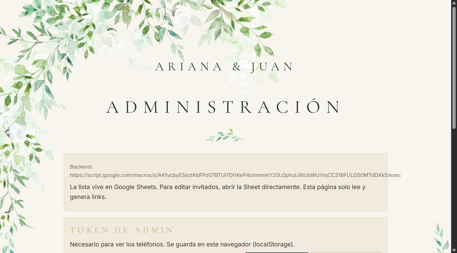
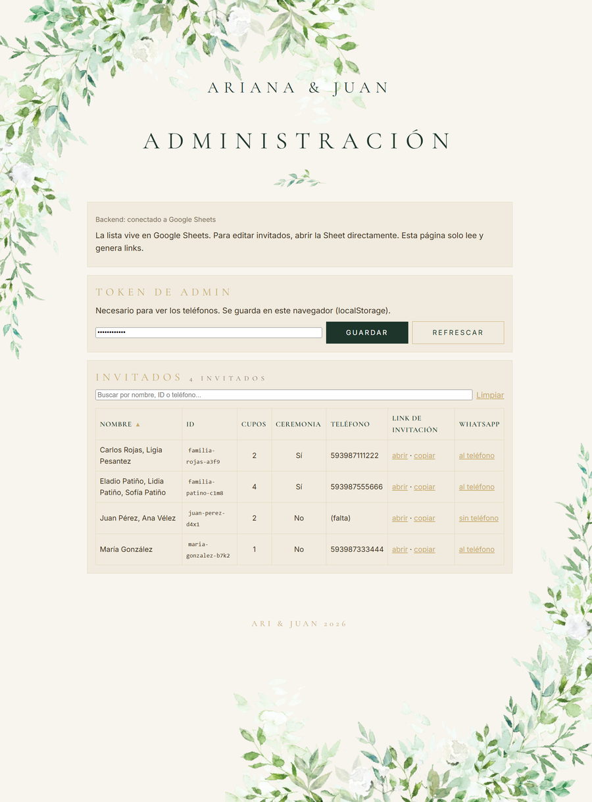

# Guía de usuario: sitio de boda Ariana & Juan

Esta guía explica cómo funciona el sitio `arijuan2026.com`, tanto para los invitados como para la administración (los novios o quien gestione la lista).

Índice:
1. [Qué es el sitio](#1-que-es-el-sitio)
2. [Cómo lo usan los invitados](#2-como-lo-usan-los-invitados)
3. [Dónde viven los datos (Google Sheets)](#3-donde-viven-los-datos-google-sheets)
4. [Página de administración](#4-pagina-de-administracion)
5. [Cómo llegan las confirmaciones (RSVP)](#5-como-llegan-las-confirmaciones-rsvp)
6. [Tareas comunes](#6-tareas-comunes)
7. [Mantenimiento técnico](#7-mantenimiento-tecnico)

---

## 1. Qué es el sitio

Es una invitación digital de boda con sitio web. Tiene cuatro partes:

- **Invitación personalizada** (`/?id=...`): cada invitado recibe un enlace único. Al abrirlo ve su saludo con su nombre y los datos de la boda según a qué esté invitado (ceremonia + recepción, o solo recepción).
- **Sitio de la boda** (`/boda/`): páginas públicas con Inicio, Cronograma, Regalos, Galería y Preguntas Frecuentes.
- **Confirmación de asistencia / RSVP** (`/rsvp/`): formulario para confirmar. Al enviarlo se abre WhatsApp con la respuesta lista para mandar a los novios, y la respuesta queda guardada en una hoja de cálculo.
- **Administración** (`/admin/`): página oculta para ver la lista de invitados y generar los enlaces de invitación para enviar por WhatsApp.

Los datos reales (nombres, teléfonos, confirmaciones) viven en una **Google Sheet**. El sitio solo los lee y los muestra.

---

## 2. Cómo lo usan los invitados

### Paso 1: reciben el enlace por WhatsApp

Desde la administración se genera un mensaje con el enlace personalizado, por ejemplo:
`https://arijuan2026.com/?id=ariana-rojas-p1uu`

### Paso 2: abren su invitación

El invitado ve su saludo ("Sra. Ariana Rojas", "Carlos y familia.", etc.), el texto de la invitación con los nombres de los padres, la fecha, el lugar y los eventos a los que está invitado.

### Paso 3: exploran el sitio de la boda

Desde la invitación pueden tocar "Ver sitio de la boda" o usar el menú para ver el cronograma, los regalos, la galería y las preguntas frecuentes.

### Paso 4: confirman asistencia

En "Confirmar asistencia" responden si asistirán. Si dicen que sí, se despliega el resto: cuántas personas, los nombres, la preferencia de menú (solo si están invitados a la ceremonia), una canción para la fiesta y un mensaje opcional. Al enviar se abre WhatsApp con todo listo para mandar a los novios.

---

## 3. Dónde viven los datos (Google Sheets)

Toda la información real está en una Google Sheet con dos pestañas.

### Pestaña `Invitados` (la lista que tú mantienes)

| Columna | Para qué sirve |
|---|---|
| `id` | Identificador único (GUID) de cada invitado. Es lo que va en el enlace. |
| `nombre` | Nombres de los invitados. Si son varias personas, sepáralos con coma: `Carlos Mora, Ana Vélez`. |
| `saludo` | Título opcional: `Sr`, `Sra`, etc. Se antepone al nombre en la invitación. |
| `cantidadInvitaciones` | Número de cupos reservados para esa invitación. |
| `incluyeCeremonia` | `TRUE` = ceremonia + recepción. `FALSE` = solo recepción. Vacío = se asume TRUE. |
| `mensaje` | (Opcional, no se muestra actualmente). |
| `telefono` | Teléfono en formato internacional sin `+` ni espacios. Ej: `593987654321`. |

Reglas del nombre en la invitación:
- 1 nombre → se muestra tal cual.
- 2 nombres → "Nombre1 y Nombre2".
- 3 o más → "Nombre1 y familia."

### Pestaña `RSVPs` (se llena sola)

Cuando un invitado confirma, se agrega una fila automáticamente. No hay que escribir aquí. Las columnas son: `timestamp`, `id_invitado`, `nombre_invitado`, `asistira_ceremonia`, `asistira_recepcion`, `acompanante`, `cantidad_asistentes`, `detalles_asistentes`, `cancion`, `mensaje`, `raw_json`.

---

## 4. Página de administración

Está en `https://arijuan2026.com/admin/`. No está enlazada en ningún lado y no aparece en buscadores. Sirve para ver la lista y generar los enlaces de invitación.

### Protección por token

La lista está protegida. Al entrar sin token no se ve ningún dato:

Para verla, pega el **token de administración** (el `ADMIN_TOKEN`) en el campo de arriba y toca "Guardar". El token se guarda solo en tu navegador. Si lo pegas en otro dispositivo, hay que volver a ingresarlo.

> ¿Dónde está el token? Lo defines tú en las propiedades del Apps Script (Project Settings > Script Properties > `ADMIN_TOKEN`). Es secreto: no lo compartas ni lo publiques.

### La tabla de invitados

Con el token correcto se muestra la lista completa con teléfonos:

Qué puedes hacer aquí:

- **Buscar**: la caja superior filtra por nombre, ID o teléfono mientras escribes. El contador muestra "X de Y invitados".
- **Ordenar**: toca cualquier encabezado (Nombre, ID, Cupos, Ceremonia, Teléfono) para ordenar. Un segundo toque invierte el orden (la flecha ▲ / ▼ indica cuál está activo).
- **Ceremonia**: la columna muestra "Sí" o "No" según si esa invitación incluye la ceremonia.
- **Link de invitación**: "abrir" lo previsualiza; "copiar" copia el enlace al portapapeles para pegarlo donde quieras.
- **WhatsApp**: "al teléfono" abre WhatsApp con el mensaje de invitación listo para ese invitado (si tiene teléfono). Si no tiene teléfono, abre WhatsApp para que elijas el destinatario.

> Para **editar** invitados (agregar, cambiar nombres, marcar ceremonia, etc.) se hace directamente en la Google Sheet. La página de admin solo lee y genera enlaces.

### Enviar las invitaciones

1. Entra a `/admin/` y pon tu token.
2. Para cada invitado, toca "al teléfono" en la columna WhatsApp.
3. Se abre WhatsApp con el mensaje y el enlace personalizado. Revisa y envía.

---

## 5. Cómo llegan las confirmaciones (RSVP)

Cuando un invitado confirma asistencia pasan dos cosas:

1. **WhatsApp**: se abre WhatsApp en su teléfono con un resumen de su respuesta dirigido al número de los novios. El invitado solo tiene que tocar enviar.
2. **Google Sheet**: la respuesta se guarda automáticamente en la pestaña `RSVPs`.

Así, aunque el invitado olvide enviar el WhatsApp, la confirmación queda registrada en la hoja. Para ver todas las confirmaciones, abre la pestaña `RSVPs` de la Google Sheet.

---

## 6. Tareas comunes

### Agregar invitados

1. Abre la Google Sheet, pestaña `Invitados`.
2. Agrega una fila con `nombre`, `cantidadInvitaciones`, `incluyeCeremonia` y `telefono`. Deja `id` vacío.
3. Para generar los `id` (GUID) faltantes: en la Sheet, **Extensiones > Apps Script**, elige la función `generarGuidsFaltantes` y pulsa **Run**.
4. Listo: el invitado ya aparece en `/admin/` y su enlace funciona.

### Cambiar a quién se invita a la ceremonia

En la columna `incluyeCeremonia`: `TRUE` = ceremonia + recepción, `FALSE` = solo recepción. El cambio se refleja en la invitación y en el cronograma del invitado.

### Reemplazar las imágenes de la invitación

Las fotos de Ceremonia, Recepción y Código de vestimenta son, por ahora, imágenes de 1 píxel (invisibles). Para poner las reales, reemplaza estos archivos manteniendo el mismo nombre:
- `assets/img/invitacion/ceremonia.jpg`
- `assets/img/invitacion/recepcion.jpg`
- `assets/img/invitacion/vestimenta.jpg`

### Cambiar datos de la boda (fecha, horas, lugar, datos bancarios)

Casi todo vive en `data/config.json`. Los textos largos (preguntas frecuentes, regalos) están en sus páginas HTML dentro de `boda/`.

---

## 7. Mantenimiento técnico

- El sitio es estático y se hospeda en GitHub Pages. Cualquier cambio que se suba al repositorio se publica solo en uno o dos minutos.
- El backend (lectura de invitados y guardado de RSVPs) es un Google Apps Script. Si se cambia el código del script (`docs/apps-script.gs`) o se renombran columnas de la Sheet, hay que **redesplegar**: en el editor de Apps Script, **Deploy > Manage deployments > editar > New version > Deploy**.
- El sitio funciona como app instalable (PWA) y cachea su contenido. Cuando se publican cambios, los invitados que ya lo abrieron los reciben en su siguiente visita.
- La lista real de invitados y los archivos con datos personales (Excel, Word) no se suben al repositorio por privacidad.

Para detalles de configuración del backend, ver [`google-sheets-setup.md`](google-sheets-setup.md).
